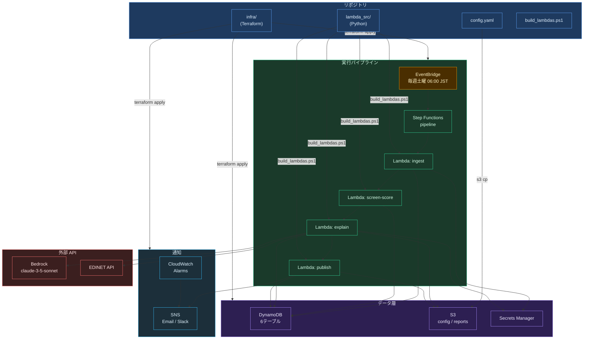
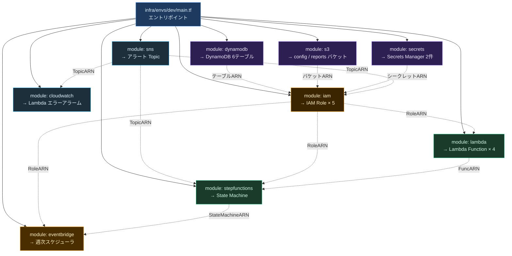
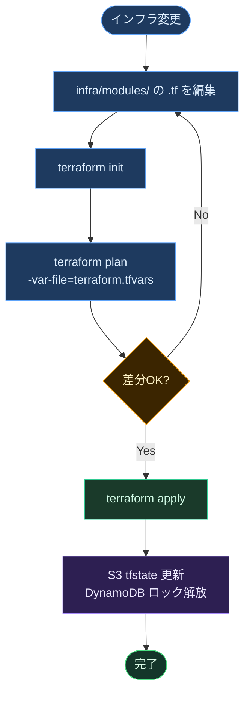
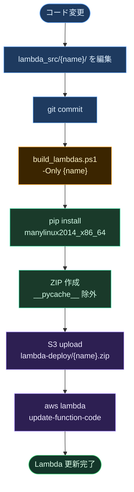
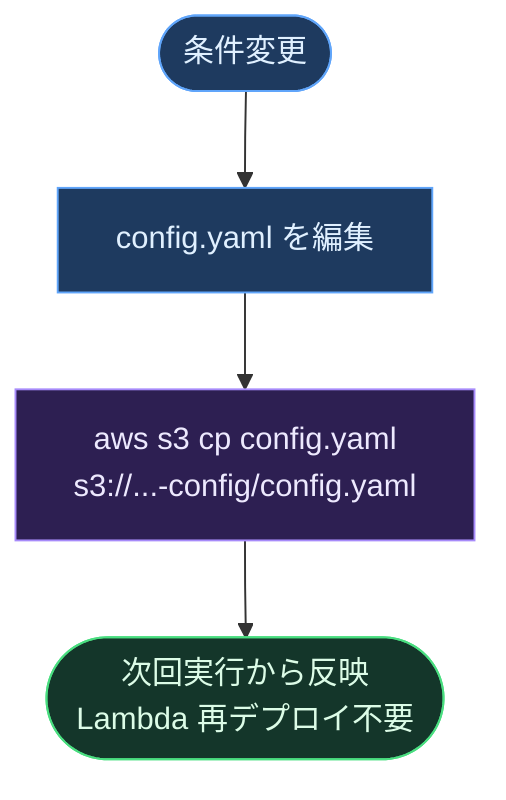

# 運用アーキテクチャ・構成管理ガイド

## 1. 全体構成マップ



---

## 2. Terraform モジュール構成



---

## 3. デプロイフロー

### 3-1. インフラ変更（Terraform）



> **現状注意**: Terraform 未インストールのため IAM 変更は `aws iam put-role-policy` で直接適用。  
> `iam/main.tf` には反映済みだが **tfstate とドリフトあり**。Terraform 導入時は `terraform import` が必要。

### 3-2. Lambda コード変更



### 3-3. 設定変更（config.yaml）



---

## 4. 週次パイプライン実行フロー

```mermaid
flowchart TD
    EB["EventBridge\n毎週土曜 06:00 JST"]
    SFN["Step Functions 起動\nrun_id 生成"]

    I1["ingest: J-Quants API キー取得\n(Secrets Manager)"]
    I2["RunLogs から前回実行日取得"]
    I3["前回実行日翌日〜昨日の\n全営業日データ取得"]
    I4["Securities / PriceHistory /\nFundamentals を DynamoDB 書き込み"]
    I5["last_success_date 更新"]

    S1["screen-score: config.yaml 読み込み"]
    S2["Fundamentals から 5年 FY データ取得"]
    S3["バフェット定量フィルタ適用\nROE・EPS CAGR・CFO 品質 等"]
    S4["スコアリング (定量 3 軸)\n→ Candidates 書き込み"]

    E1["explain: EDINET API キー取得"]
    E2["有価証券報告書テキスト取得\n(EDINET API)"]
    E3["Bedrock 定性スコアリング\n(5 次元 × 0-10 点)"]
    E4["最終スコア算出\n定量 × 0.4 + 定性 × 0.6"]
    E5["HTML レポート生成 → S3 保存"]

    P1["publish: 署名付き URL 生成"]
    P2["SNS 通知 (Email / Slack)"]
    END(["完了"])
    ERR["NotifyError\n(SNS 通知)"]

    EB --> SFN --> I1 --> I2 --> I3 --> I4 --> I5
    I5 --> S1 --> S2 --> S3 --> S4
    S4 --> E1 --> E2 --> E3 --> E4 --> E5
    E5 --> P1 --> P2 --> END
    SFN -->|エラー時| ERR

    style EB fill:#4a2e00,stroke:#f59e0b,color:#fef3c7
    style SFN fill:#1a3a2a,stroke:#34d399,color:#d1fae5
    style I1 fill:#1a3a2a,stroke:#34d399,color:#d1fae5
    style I2 fill:#1a3a2a,stroke:#34d399,color:#d1fae5
    style I3 fill:#1a3a2a,stroke:#34d399,color:#d1fae5
    style I4 fill:#2d1f52,stroke:#a78bfa,color:#ede9fe
    style I5 fill:#2d1f52,stroke:#a78bfa,color:#ede9fe
    style S1 fill:#1a3a2a,stroke:#34d399,color:#d1fae5
    style S2 fill:#2d1f52,stroke:#a78bfa,color:#ede9fe
    style S3 fill:#1a3a2a,stroke:#34d399,color:#d1fae5
    style S4 fill:#2d1f52,stroke:#a78bfa,color:#ede9fe
    style E1 fill:#1a3a2a,stroke:#34d399,color:#d1fae5
    style E2 fill:#3b1f1f,stroke:#f87171,color:#fee2e2
    style E3 fill:#3b1f1f,stroke:#f87171,color:#fee2e2
    style E4 fill:#1a3a2a,stroke:#34d399,color:#d1fae5
    style E5 fill:#2d1f52,stroke:#a78bfa,color:#ede9fe
    style P1 fill:#1c2f3a,stroke:#38bdf8,color:#e0f2fe
    style P2 fill:#1c2f3a,stroke:#38bdf8,color:#e0f2fe
    style END fill:#14362a,stroke:#4ade80,color:#dcfce7
    style ERR fill:#3b1f1f,stroke:#f87171,color:#fee2e2
```



---

## 5. シークレット管理

| シークレット名 | 参照 Lambda |
|---|---|
| `investment/dev/jquants-api-key` | ingest |
| `investment/dev/slack-webhook-url` | publish |
| `investment-dev/edinet-api-key` | explain |

シークレット値はコード・設定ファイル・git 履歴に一切含めない。  
IAM ポリシーで各 Lambda から当該シークレットのみ `GetSecretValue` を許可。

---

## 6. 現状のドリフト（IaC 未適用分）

以下はすべて `.tf` に反映済み。Terraform 導入後に `terraform apply` で収束させること。  
シークレットの**値**は Terraform 管理外（CLI または AWS Console で設定）。**定義（リソースシェル）**は `.tf` で管理する。

| 変更内容 | 適用済み手段 | .tf 反映 |
|---|---|---|
| explain IAM: BatchWriteItem/PutItem/UpdateItem on Candidates | aws iam put-role-policy | ✅ iam/main.tf |
| explain IAM: secretsmanager:GetSecretValue (EDINET key) | aws iam put-role-policy | ✅ iam/main.tf |
| ingest IAM: dynamodb:GetItem | aws iam put-role-policy | ✅ iam/main.tf |
| `investment-dev/edinet-api-key` シークレット定義 | aws secretsmanager create-secret | ✅ secrets/main.tf |

---

## 7. ファイル構成

```
investment/
├── infra/                        # Terraform (IaC)
│   ├── backend.tf                # tfstate バックエンド ※YOUR_ACCOUNT_ID 要置換
│   ├── envs/dev/main.tf          # モジュール呼び出しエントリポイント
│   └── modules/
│       ├── dynamodb/             # DynamoDB テーブル定義
│       ├── s3/                   # S3 バケット定義
│       ├── secrets/              # Secrets Manager (値はプレースホルダ)
│       ├── sns/                  # SNS トピック
│       ├── iam/                  # IAM ロール定義
│       ├── lambda/               # Lambda 関数定義
│       ├── stepfunctions/        # Step Functions 定義
│       ├── eventbridge/          # 週次スケジューラ (dev=DISABLED)
│       └── cloudwatch/           # Lambda エラーアラーム
│
├── lambda_src/                   # Lambda ソース (pip 生成物は .gitignore)
│   ├── ingest/                   # J-Quants データ取得
│   ├── screen_score/             # バフェット定量フィルタ + スコアリング
│   ├── explain/                  # EDINET + Bedrock 定性評価
│   └── publish/                  # レポート生成・SNS 通知
│
├── scripts/build_lambdas.ps1     # Lambda ビルド & デプロイ
├── config.yaml                   # スクリーニング条件 (再デプロイ不要で変更可)
└── docs/                         # 設計ドキュメント
```

---

## 8. Terraform 導入手順（未導入環境向け）

```powershell
# 1. インストール
winget install HashiCorp.Terraform

# 2. バックエンド用リソース作成（初回のみ）
$ACCOUNT = aws sts get-caller-identity --query Account --output text
aws s3 mb s3://investment-tfstate-$ACCOUNT --region ap-northeast-1
aws s3api put-bucket-versioning --bucket investment-tfstate-$ACCOUNT `
    --versioning-configuration Status=Enabled
aws dynamodb create-table --table-name investment-tflock `
    --attribute-definitions AttributeName=LockID,AttributeType=S `
    --key-schema AttributeName=LockID,KeyType=HASH `
    --billing-mode PAY_PER_REQUEST --region ap-northeast-1

# 3. backend.tf の YOUR_ACCOUNT_ID を実際のアカウント ID に置換

# 4. terraform.tfvars を作成（.gitignore 済み）
# infra/envs/dev/terraform.tfvars:
#   environment = "dev"
#   account_id  = "304513313801"
#   aws_region  = "ap-northeast-1"
#   alert_email = "your@email.com"

# 5. 初期化 & 適用
cd infra/envs/dev
terraform init
terraform plan -var-file=terraform.tfvars
terraform apply -var-file=terraform.tfvars
```
