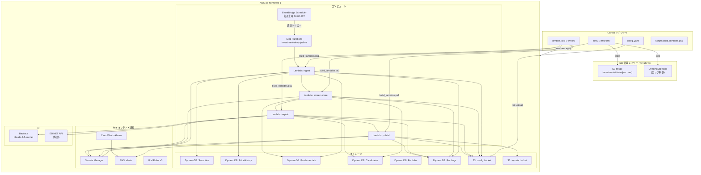
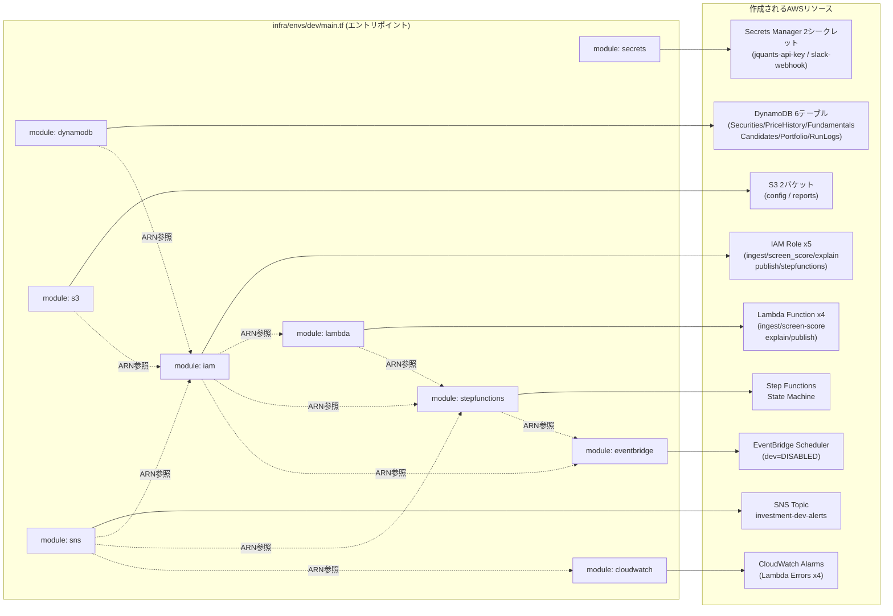
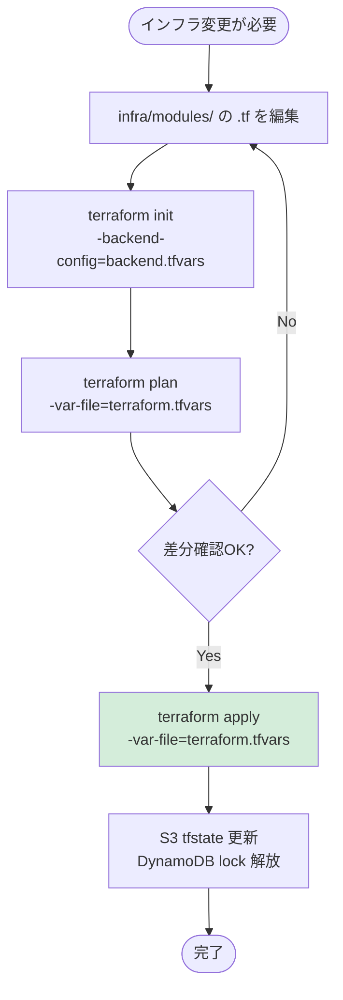
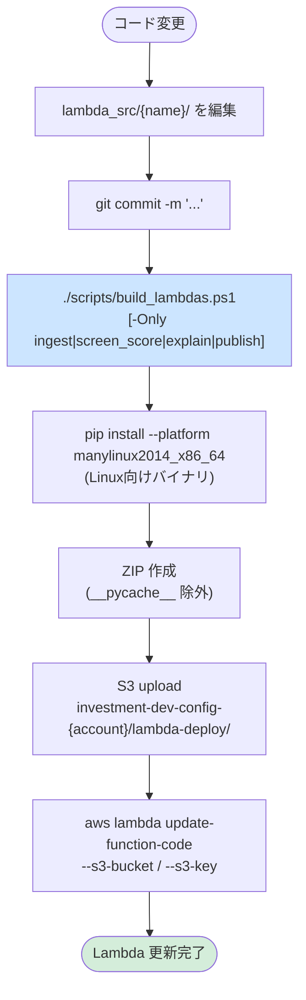
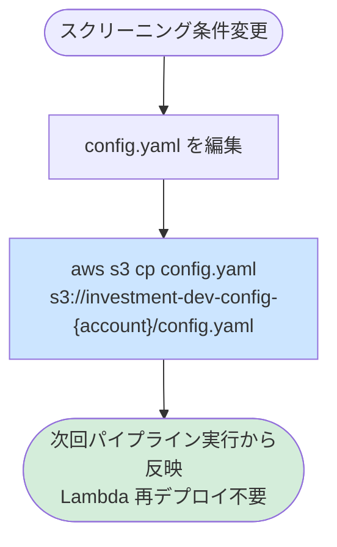
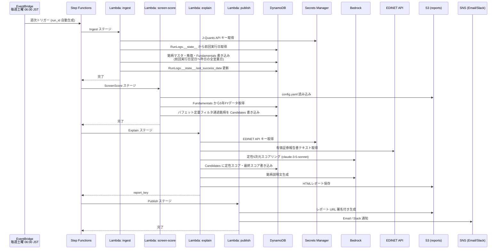

# 運用アーキテクチャ・構成管理ガイド

## 1. 全体構成マップ



---

## 2. Terraform モジュール構成



---

## 3. デプロイフロー

### 3-1. インフラ変更（Terraform）



> **注意（現状）** : Terraform は未インストール環境のため、IAM ポリシー変更は  
> `aws iam put-role-policy` で直接適用している。`infra/modules/iam/main.tf` には  
> 変更内容を反映済みだが、**tfstate との乖離（ドリフト）が発生している**。  
> Terraform 導入後は `terraform import` でインポートするか、リソースを再作成する必要がある。

### 3-2. Lambda コード変更



### 3-3. 設定変更（config.yaml）



---

## 4. 週次パイプライン実行フロー



---

## 5. シークレット管理

| シークレット名 | 管理場所 | 参照元 |
|---|---|---|
| `investment/dev/jquants-api-key` | Secrets Manager | ingest Lambda |
| `investment/dev/slack-webhook-url` | Secrets Manager | publish Lambda |
| `investment-dev/edinet-api-key` | Secrets Manager | explain Lambda |
| J-Quants リフレッシュトークン | Secrets Manager (上記に内包) | ingest Lambda |

**ルール**: シークレット値はコード・設定ファイル・git 履歴に一切含めない。  
IAM ポリシーで各 Lambda から当該シークレットのみ `GetSecretValue` を許可している。

---

## 6. 現状のドリフト（IaC 乖離）

Terraform が未インストールのため、以下を CLI で直接適用している。  
**Terraform 導入時に `terraform import` または `terraform apply` で解消すること。**

| 変更内容 | 適用方法 | .tf への反映 |
|---|---|---|
| explain Lambda IAM に `BatchWriteItem/PutItem/UpdateItem` on Candidates 追加 | `aws iam put-role-policy` | ✅ `iam/main.tf` 反映済み |
| explain Lambda IAM に `secretsmanager:GetSecretValue` (EDINET key) 追加 | `aws iam put-role-policy` | ❌ 未反映 |
| ingest Lambda IAM に `dynamodb:GetItem` 追加 | `aws iam put-role-policy` | ✅ `iam/main.tf` 反映済み |
| `investment-dev/edinet-api-key` シークレット作成 | `aws secretsmanager create-secret` | ❌ `secrets/main.tf` 未反映 |

---

## 7. ファイル構成と役割

```
investment/
├── infra/                        # Terraform (IaC)
│   ├── backend.tf                # tfstate バックエンド設定
│   ├── versions.tf               # プロバイダバージョン制約
│   ├── envs/dev/
│   │   ├── main.tf               # モジュール呼び出しエントリポイント
│   │   ├── variables.tf          # 環境変数定義
│   │   ├── outputs.tf            # 出力値
│   │   └── terraform.tfvars      # ← .gitignore (account_id 等を含む)
│   └── modules/
│       ├── dynamodb/             # DynamoDB テーブル定義
│       ├── s3/                   # S3 バケット定義
│       ├── secrets/              # Secrets Manager (値はプレースホルダ)
│       ├── sns/                  # SNS トピック・サブスクリプション
│       ├── iam/                  # Lambda・SFN・Scheduler の IAM ロール
│       ├── lambda/               # Lambda 関数定義
│       ├── stepfunctions/        # Step Functions ステートマシン定義
│       ├── eventbridge/          # 週次スケジューラ定義
│       └── cloudwatch/           # Lambda エラーアラーム定義
│
├── lambda_src/                   # Lambda ソースコード (pip 生成物は .gitignore)
│   ├── ingest/                   # データ取得 (J-Quants API)
│   ├── screen_score/             # バフェット定量フィルタ + スコアリング
│   ├── explain/                  # EDINET + Bedrock 定性評価
│   └── publish/                  # レポート生成・SNS 通知
│
├── scripts/
│   └── build_lambdas.ps1         # Lambda ビルド & デプロイスクリプト
│
├── config.yaml                   # スクリーニング条件 (Lambda 再デプロイ不要で変更可)
└── docs/                         # 設計ドキュメント
```

---

## 8. Terraform 導入手順（未導入環境向け）

```powershell
# 1. Terraform インストール (winget)
winget install HashiCorp.Terraform

# 2. バックエンド用リソースを事前に作成（初回のみ）
$ACCOUNT = aws sts get-caller-identity --query Account --output text
aws s3 mb s3://investment-tfstate-$ACCOUNT --region ap-northeast-1
aws s3api put-bucket-versioning --bucket investment-tfstate-$ACCOUNT `
    --versioning-configuration Status=Enabled
aws dynamodb create-table --table-name investment-tflock `
    --attribute-definitions AttributeName=LockID,AttributeType=S `
    --key-schema AttributeName=LockID,KeyType=HASH `
    --billing-mode PAY_PER_REQUEST --region ap-northeast-1

# 3. terraform.tfvars を作成（.gitignore 済み）
# infra/envs/dev/terraform.tfvars に記述:
#   environment = "dev"
#   account_id  = "304513313801"
#   aws_region  = "ap-northeast-1"
#   alert_email = "your@email.com"

# 4. 初期化 & backend.tf のアカウントID修正
cd infra/envs/dev
# backend.tf の YOUR_ACCOUNT_ID を実アカウント ID に置換後:
terraform init
terraform plan -var-file=terraform.tfvars

# 5. ドリフト解消: CLI適用済みリソースをインポート
terraform import module.iam.aws_iam_role_policy.ingest \
    investment-dev-lambda-ingest:terraform-20260624214409041500000006
```
